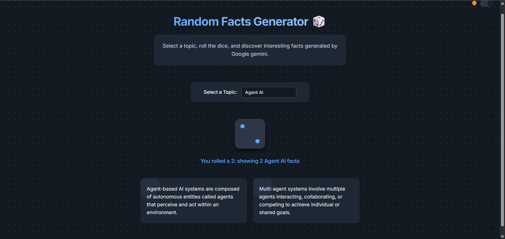

# 🎲⭐ Random Facts Generator


An interactive web application that generates random facts on various topics through a dice roll mechanism. Roll the dice and learn something new about your favorite topics!

## 🌟 Features

* 🎲 Interactive dice with realistic rolling animation
* 🧠 Displays facts equal to the number you roll on the dice (1-6)
* 📚 Multiple topics to choose from (Agent AI, Space, History, Nature, Technology, Science)
* 🤖 Integration with Google's Gemini API for dynamically generated facts
* 🔄 Automatic fallback to pre-defined facts when API key is not available
* 🌓 Dark/light theme toggle with persistent preferences
* 🎵 Sound effects for dice rolling
* 📱 Fully responsive design for all devices
* 🎭 Beautiful UI with smooth animations and transitions

## 🛠️ Technologies Used

* **HTML** - Structure of the web application
* **CSS** - Modern styling with CSS variables for theming
* **JavaScript** - Interactive functionality and animations
* **Gemini API** - AI-powered fact generation
* **Local Storage API** - To save theme preferences

## ⚙️ Installation

1. Clone the repository:
```bash
git clone https://github.com/Bikram-Mondal3/Random-facts-Generator.git
```

2. Navigate to the project directory:
```bash
cd Random-facts-Generator
```

3. Set up your Gemini API key:
   - Rename `.env.example` to `.env`
   - Replace the placeholder with your actual Gemini API key

4. Open `index.html` in your web browser

## 🚀 How to Use

1. 📋 Select a topic from the dropdown menu
2. 🎲 Click on the dice (or press Enter/Space while focused)
3. 🎯 The dice will roll and display a random number (1-6)
4. 📝 Facts about your chosen topic will appear below (the number of facts equals the dice roll)
5. 🌓 Toggle between dark and light themes using the button in the top right

## 🤖 API Integration & Fallback Mechanism

This application uses Google's Gemini API to dynamically generate facts based on the selected topic. Here's how it works:

- The code first tries to load the API key from the `.env` file
- If the key is missing or set to the default value `your_gemini_api_key_here`, it detects this issue
- Instead of calling the Gemini API, it automatically falls back to the pre-defined facts stored in the `fallbackFacts` object
- This ensures the application remains functional even without a valid API key

**Note:** In a production environment, API keys should be managed securely on a server-side implementation rather than in client-side code.

## 📚 Available Topics

Choose from a variety of interesting topics:

- **Agent AI** - Facts about agent-based artificial intelligence systems
- **Space & Astronomy** - Facts about space, planets, stars, and cosmic phenomena
- **History** - Interesting historical events and discoveries
- **Nature & Wildlife** - Facts about animals, plants, and ecosystems
- **Technology** - Information about modern technology and innovation
- **Science** - General scientific discoveries and principles

## 🤝 Contribution

Feel free to fork this repository, submit issues, or send pull requests to improve the application.

## 📄 License

This project is licensed under the `MIT License`.
